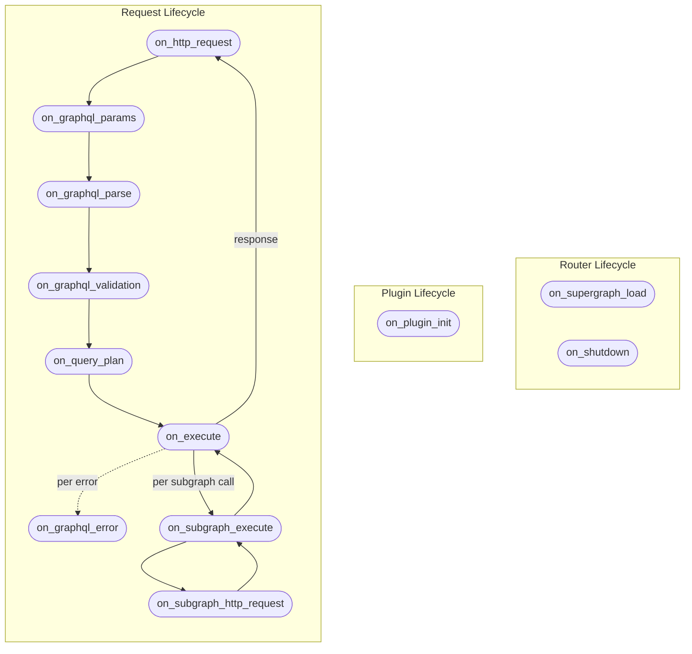

# Hooks

The following chart describes the execution order and available hooks. Each hook can have a
**start**/**end** phase, where you can control different parts of the execution flow.



## Lifetimes

Throughout the implementation of the plugin lifecycle hooks, you'll notice two named lifetimes:

- `'req`: This lifetime is used for the HTTP request context and is valid for the duration of the
  request.
- `'exec`: This lifetime represents the lifetime of the GraphQL execution. It is used to ensure that
  the payload and result are valid for the duration of the GraphQL execution.

## Plugin Lifecycle Hooks

### `on_plugin_init`

This hook is called exactly once during Router initialization, when the plugin is first loaded.

You can use this hook to access the plugin configuration, create the initial state of the plugin,
and register background tasks to be handled by the router.

```rust
fn on_plugin_init(payload: OnPluginInitPayload<Self>) -> OnPluginInitResult<Self>
```

#### Usage Examples

**Access the plugin configuration**

Use `payload.config()` to read the plugin's configuration from the Router YAML. The `?` propagates
initialization errors back to the router.

```rust
fn on_plugin_init(payload: OnPluginInitPayload<Self>) -> OnPluginInitResult<Self> {
    let config = payload.config()?;

    payload.initialize_plugin_with_defaults()
}
```

**Customize plugin instance**

Build the plugin's initial state from the parsed configuration before the router starts serving
requests.

```rust
fn on_plugin_init(payload: OnPluginInitPayload<Self>) -> OnPluginInitResult<Self> {
    payload.initialize_plugin(Self {
        my_thing: payload.config()?.my_config_flag,
    })
}
```

**Register background tasks**

Spawn long-running work tied to the router lifecycle. The `CancellationToken` is signaled when the
router shuts down.

```rust
use hive_router::background_tasks::BackgroundTask;

#[async_trait]
impl BackgroundTask for MyBackgroundTask {
    fn id(&self) -> &str {
        "my_task"
    }

    async fn run(&self, token: CancellationToken) {
        // Check token.is_cancelled() to handle graceful shutdown
    }
}

fn on_plugin_init(payload: OnPluginInitPayload<Self>) -> OnPluginInitResult<Self> {
    payload.bg_tasks_manager.register_task(MyBackgroundTask::new());
    payload.initialize_plugin_with_defaults()
}
```

#### Payload API Reference

- [`OnPluginInitPayload`](https://github.com/graphql-hive/router/blob/main/lib/executor/src/plugins/hooks/on_plugin_init.rs#:~:text=struct%20OnPluginInitPayload)

#### Plugin Examples

- [`root_field_limit`](https://github.com/graphql-hive/router/blob/main/plugin_examples/root_field_limit/src/lib.rs#:~:text=fn%20on_plugin_init)
- [`propagate_status_code`](https://github.com/graphql-hive/router/blob/main/plugin_examples/propagate_status_code/src/lib.rs#:~:text=fn%20on_plugin_init)

## Request Lifecycle Hooks

### `on_http_request`

This hook is called immediately after the router receives an HTTP request. It allows you to inspect
or modify the HTTP request before any further processing occurs. At this point, the Router doesn't
know yet if the request is a GraphQL request or not.

```rust
fn on_http_request<'req>(
    &'req self,
    payload: OnHttpRequestHookPayload<'req>
  ) -> OnHttpRequestHookResult<'req>
```

With this hook, you can add custom authentication and authorization logic based on HTTP headers,
method, path, and similar request properties. You can also implement custom restrictions, HTTP
validations, short-circuit responses, or serve static assets.

#### Usage Examples

**Reject unauthenticated requests**

Check for required HTTP headers in the start phase and short-circuit with an error before any
GraphQL processing begins.

```rust
fn on_http_request<'req>(
    &'req self,
    payload: OnHttpRequestHookPayload<'req>,
) -> OnHttpRequestHookResult<'req> {
    if payload.router_http_request.headers().get("authorization").is_none() {
        return payload.end_with_graphql_error(
            GraphQLError::from_message_and_code("Unauthorized", "UNAUTHORIZED"),
            StatusCode::UNAUTHORIZED,
        );
    }

    payload.proceed()
}
```

**Add a response header**

Use `on_end` with `map_response` to attach custom headers to every outgoing HTTP response.

```rust
fn on_http_request<'req>(
    &'req self,
    payload: OnHttpRequestHookPayload<'req>,
) -> OnHttpRequestHookResult<'req> {
    payload.on_end(|payload| {
        payload.map_response(|mut response| {
            response.response_mut().headers_mut().insert(
                "x-served-by",
                "hive-router".parse().unwrap(),
            );
            response
        }).proceed()
    })
}
```

**Override the HTTP response status**

Use `map_response` in `on_end` to rewrite the status code on the outgoing response, for example, to
normalize all successful responses to `200 OK`.

```rust
use hive_router::http::StatusCode;

fn on_http_request<'req>(
    &'req self,
    payload: OnHttpRequestHookPayload<'req>,
) -> OnHttpRequestHookResult<'req> {
    payload.on_end(|end_payload| {
        end_payload.map_response(|mut response| {
            *response.response_mut().status_mut() = StatusCode::OK;
            response
        })
    })
}
```

**Propagate subgraph status codes**

Read context data written by a downstream hook (e.g., `on_subgraph_http_request`) and apply it to
the final HTTP response status.

```rust
fn on_http_request<'req>(
    &'req self,
    payload: OnHttpRequestHookPayload<'req>,
) -> OnHttpRequestHookResult<'req> {
    payload.on_end(|payload| {
        let ctx = payload.context.get_ref::<PropagateStatusCodeCtx>();
        if let Some(ctx) = ctx {
            return payload.map_response(|mut response| {
                *response.response_mut().status_mut() = ctx.status_code;
                response
            }).proceed();
        }
        payload.proceed()
    })
}
```

#### Payload API Reference

- [`OnHttpRequestHookPayload`](https://github.com/graphql-hive/router/blob/main/lib/executor/src/plugins/hooks/on_http_request.rs#:~:text=struct%20OnHttpRequestHookPayload)
- [`OnHttpResponseHookPayload`](https://github.com/graphql-hive/router/blob/main/lib/executor/src/plugins/hooks/on_http_request.rs#:~:text=struct%20OnHttpResponseHookPayload)

#### Plugin Examples

- [`propagate_status_code`](https://github.com/graphql-hive/router/blob/main/plugin_examples/propagate_status_code/src/lib.rs#:~:text=fn%20on_http_request)
- [`incoming_request_deduplication`](https://github.com/graphql-hive/router/blob/main/plugin_examples/incoming_request_deduplication/src/plugin.rs#:~:text=fn%20on_http_request)

### `on_graphql_params`

This hook is called after the router has determined that the incoming request is a GraphQL request,
and it decides to parse the GraphQL parameters (query, variables, operation name, etc.).

This hook allows you to customize how GraphQL request parameters are detected and extracted. You can
also prevent execution of the GraphQL request if certain conditions are met.

```rust
async fn on_graphql_params<'exec>(
    &'exec self,
    payload: OnGraphQLParamsStartHookPayload<'exec>
  ) -> OnGraphQLParamsStartHookResult<'exec>
```

#### Usage Examples

**Read extracted GraphQL parameters**

Use the `on_end` callback to access the fully extracted GraphQL parameters: `query`,
`operation_name`, `variables`, and `extensions` are all available here.

```rust
async fn on_graphql_params<'exec>(
    &'exec self,
    payload: OnGraphQLParamsStartHookPayload<'exec>,
) -> OnGraphQLParamsStartHookResult<'exec> {
    payload.on_end(|end_payload| {
        let maybe_operation_name = &end_payload.graphql_params.operation_name.as_ref();
        let maybe_query = &end_payload.graphql_params.query.as_ref();
        let variables = &end_payload.graphql_params.variables;

        end_payload.proceed()
    })
}
```

**Modify extracted GraphQL parameters**

Mutate the extracted GraphQL parameters inside `on_end` to override the query, operation name, or
variables before execution continues.

```rust
async fn on_graphql_params<'exec>(
    &'exec self,
    payload: OnGraphQLParamsStartHookPayload<'exec>,
) -> OnGraphQLParamsStartHookResult<'exec> {
    payload.on_end(|mut end_payload| {
        end_payload.graphql_params.query = Some("query { overridingTheOperation }".to_string());

        end_payload.proceed()
    })
}
```

**Reject anonymous operations**

Return a GraphQL error from `on_end` to short-circuit the request when a condition on the parsed
parameters is not met.

```rust
async fn on_graphql_params<'exec>(
    &'exec self,
    payload: OnGraphQLParamsStartHookPayload<'exec>,
) -> OnGraphQLParamsStartHookResult<'exec> {
    payload.on_end(|payload| {
        if payload.graphql_params.operation_name.is_none() {
            return payload.end_with_graphql_error(
                GraphQLError::from_message_and_code(
                    "Anonymous operations are not allowed",
                    "ANONYMOUS_OPERATION",
                ),
                StatusCode::BAD_REQUEST,
            );
        }
        payload.proceed()
    })
}
```

**Resolve a query from extensions (Persisted Queries)**

Read from `extensions` in `on_end` and rewrite `graphql_params.query` to implement patterns like
Automatic Persisted Queries (APQ).

```rust
async fn on_graphql_params<'exec>(
    &'exec self,
    payload: OnGraphQLParamsStartHookPayload<'exec>,
) -> OnGraphQLParamsStartHookResult<'exec> {
    payload.on_end(|mut payload| {
        let hash = payload
            .graphql_params
            .extensions
            .as_ref()
            .and_then(|ext| ext.get("persistedQuery"))
            .and_then(|pq| pq.as_object())
            .and_then(|obj| obj.get(&"sha256Hash"))
            .and_then(|h| h.as_str());

        if let Some(hash) = hash {
            if let Some(cached_query) = self.cache.get(hash) {
                payload.graphql_params.query = Some(cached_query.value().to_string());
            } else {
                return payload.end_with_graphql_error(
                    GraphQLError::from_message_and_code(
                        "PersistedQueryNotFound",
                        "PERSISTED_QUERY_NOT_FOUND",
                    ),
                    StatusCode::BAD_REQUEST,
                );
            }
        }
        payload.proceed()
    })
}
```

#### Payload API Reference

- [`OnGraphQLParamsStartHookPayload`](https://github.com/graphql-hive/router/blob/main/lib/executor/src/plugins/hooks/on_graphql_params.rs#:~:text=struct%20OnGraphQLParamsStartHookPayload)
- [`OnGraphQLParamsEndHookPayload`](https://github.com/graphql-hive/router/blob/main/lib/executor/src/plugins/hooks/on_graphql_params.rs#:~:text=struct%20OnGraphQLParamsEndHookPayload)

#### Plugin Examples

- [`forbid_anonymous_operations`](https://github.com/graphql-hive/router/blob/main/plugin_examples/forbid_anonymous_operations/src/plugin.rs#:~:text=fn%20on_graphql_params)
- [`apq`](https://github.com/graphql-hive/router/blob/main/plugin_examples/apq/src/plugin.rs#:~:text=fn%20on_graphql_params)
- [`multipart`](https://github.com/graphql-hive/router/blob/main/plugin_examples/multipart/src/plugin.rs#:~:text=fn%20on_graphql_params)
- [`async_auth`](https://github.com/graphql-hive/router/blob/main/plugin_examples/async_auth/src/plugin.rs#:~:text=fn%20on_graphql_params)
- [`incoming_request_deduplication`](https://github.com/graphql-hive/router/blob/main/plugin_examples/incoming_request_deduplication/src/plugin.rs#:~:text=fn%20on_graphql_params)

### `on_graphql_parse`

This hook is called after the request has been deserialized, and before the router parses the
GraphQL request body as specified by the
[GraphQL-over-HTTP spec](https://graphql.github.io/graphql-over-http/).

```rust
async fn on_graphql_parse<'exec>(
        &'exec self,
        payload: OnGraphQLParseStartHookPayload<'exec>,
    ) -> OnGraphQLParseHookResult<'exec>
```

#### Usage Examples

**Read the raw query string**

The start phase has access to the raw `GraphQLParams`, including the unparsed query string, before
the router parses it into a document.

```rust
async fn on_graphql_parse<'exec>(
    &'exec self,
    payload: OnGraphQLParseStartHookPayload<'exec>,
) -> OnGraphQLParseHookResult<'exec> {
    let raw_query = &payload.graphql_params.query;

    payload.proceed()
}
```

**Access the parsed document (AST)**

Use `on_end` to access the fully parsed `Document` AST after the router has completed parsing the
operation.

```rust
async fn on_graphql_parse<'exec>(
    &'exec self,
    payload: OnGraphQLParseStartHookPayload<'exec>,
) -> OnGraphQLParseHookResult<'exec> {
    payload.on_end(|end_payload| {
        let document = &end_payload.document;

        end_payload.proceed()
    })
}
```

#### Payload API Reference

- [`OnGraphQLParseStartHookPayload`](https://github.com/graphql-hive/router/blob/main/lib/executor/src/plugins/hooks/on_graphql_parse.rs#:~:text=struct%20OnGraphQLParseStartHookPayload)
- [`OnGraphQLParseEndHookPayload`](https://github.com/graphql-hive/router/blob/main/lib/executor/src/plugins/hooks/on_graphql_parse.rs#:~:text=struct%20OnGraphQLParseEndHookPayload)

### `on_graphql_validation`

This hook is called during the GraphQL validation phase of the Router. At this stage, the GraphQL
operation has been extracted and parsed from the incoming request, and validation rules are being
applied against the GraphQL schema.

Plugins can use this hook to add custom validation rules, skip validation entirely, or modify the
operation prior to validation.

```rust
async fn on_graphql_validation<'exec>(
        &'exec self,
        payload: OnGraphQLValidationStartHookPayload<'exec>,
    ) -> OnGraphQLValidationStartHookResult<'exec>
```

#### Usage Examples

**Add a custom validation rule**

Implement `ValidationRule` and register it with `payload.with_validation_rule()` to enforce custom
constraints on every incoming operation.

```rust
impl ValidationRule for MyCustomValidationRule {
    fn error_code<'a>(&self) -> &'a str {
        "MAX_ALIASES_EXCEEDED"
    }

    fn validate(
        &self,
        ctx: &mut OperationVisitorContext<'_>,
        error_collector: &mut ValidationErrorContext,
    ) {
        // ...
    }
}

async fn on_graphql_validation<'exec>(
    &'exec self,
    payload: OnGraphQLValidationStartHookPayload<'exec>,
) -> OnGraphQLValidationStartHookResult<'exec> {
    payload.with_validation_rule(MyCustomValidationRule::new()).proceed()
}
```

#### Payload API Reference

- [`OnGraphQLValidationStartHookPayload`](https://github.com/graphql-hive/router/blob/main/lib/executor/src/plugins/hooks/on_graphql_validation.rs#:~:text=struct%20OnGraphQLValidationStartHookPayload)
- [`OnGraphQLValidationEndHookPayload`](https://github.com/graphql-hive/router/blob/main/lib/executor/src/plugins/hooks/on_graphql_validation.rs#:~:text=struct%20OnGraphQLValidationEndHookPayload)

#### Plugin Examples

- [`root_field_limit`](https://github.com/graphql-hive/router/blob/main/plugin_examples/root_field_limit/src/lib.rs#:~:text=fn%20on_graphql_validation)
- [`one_of`](https://github.com/graphql-hive/router/blob/main/plugin_examples/one_of/src/lib.rs#:~:text=fn%20on_graphql_validation)

### `on_query_plan`

This hook is invoked during the Federation query planning process. At this stage, the Router has
already extracted, parsed, and validated the GraphQL operation and is ready to plan how to execute
it across subgraphs.

This hook gives plugins access to the Router's internal query planning process, allowing them to
modify the operation being planned or inspect and modify the resulting plan.

```rust
async fn on_query_plan<'exec>(
    &'exec self,
    payload: OnQueryPlanStartHookPayload<'exec>,
  ) -> OnQueryPlanStartHookResult<'exec>
```

#### Usage Examples

**Inspect the query plan**

Use `on_end` to access the constructed `QueryPlan` after the planner has completed. This runs after
operation parsing and validation.

```rust
async fn on_query_plan<'exec>(
    &'exec self,
    payload: OnQueryPlanStartHookPayload<'exec>,
) -> OnQueryPlanStartHookResult<'exec> {
    payload.on_end(|end_payload| {
        let query_plan = &end_payload.query_plan;

        end_payload.proceed()
    })
}
```

**Reject based on query plan content**

Inspect the plan in `on_end` and short-circuit with an error if the operation exceeds a policy - for
example, too many root fields.

```rust
async fn on_query_plan<'exec>(
    &'exec self,
    payload: OnQueryPlanStartHookPayload<'exec>,
) -> OnQueryPlanStartHookResult<'exec> {
    payload.on_end(|end_payload| {
        let root_field_count = count_root_fields(&end_payload.query_plan);
        if root_field_count > self.max_root_fields {
            return end_payload.end_with_graphql_error(
                GraphQLError::from_message_and_code(
                    "Query exceeds the maximum number of root fields",
                    "TOO_MANY_ROOT_FIELDS",
                ),
                StatusCode::PAYLOAD_TOO_LARGE,
            );
        }
        end_payload.proceed()
    })
}
```

#### Payload API Reference

- [`OnQueryPlanStartHookPayload`](https://github.com/graphql-hive/router/blob/main/lib/executor/src/plugins/hooks/on_query_plan.rs#:~:text=struct%20OnQueryPlanStartHookPayload)
- [`OnQueryPlanEndHookPayload`](https://github.com/graphql-hive/router/blob/main/lib/executor/src/plugins/hooks/on_query_plan.rs#:~:text=struct%20OnQueryPlanEndHookPayload)

#### Plugin Examples

- [`root_field_limit`](https://github.com/graphql-hive/router/blob/main/plugin_examples/root_field_limit/src/lib.rs#:~:text=fn%20on_query_plan)

### `on_execute`

This hook is invoked during the Federation query execution process. At this stage, the Router has
already extracted, parsed, and validated the GraphQL operation, and a query plan has been
constructed and is ready to be executed.

Plugins can use this hook to observe the execution process or implement solutions such as response
caching that bypass it entirely.

```rust
async fn on_execute<'exec>(
    &'exec self,
    payload: OnExecuteStartHookPayload<'exec>,
  ) -> OnExecuteStartHookResult<'exec>
```

#### Usage Examples

**Return a cached response**

Bypass the execution pipeline entirely and return a pre-built response - useful for response
caching, where a cached result can be served without querying any subgraphs.

```rust
async fn on_execute<'exec>(
    &'exec self,
    payload: OnExecuteStartHookPayload<'exec>,
) -> OnExecuteStartHookResult<'exec> {
    if let Some(cached) = self.cache.get(&cache_key) {
        return payload.end_with_response(cached);
    }

    payload.proceed()
}
```

**Inspect the GraphQL response**

Use `on_end` to read the executed `data` and `errors` before they are serialized and sent to the
client - useful for caching the result or collecting metrics.

```rust
async fn on_execute<'exec>(
    &'exec self,
    payload: OnExecuteStartHookPayload<'exec>,
) -> OnExecuteStartHookResult<'exec> {
    payload.on_end(|end_payload| {
        let data = &end_payload.data;
        let errors = &end_payload.errors;

        end_payload.proceed()
    })
}
```

**Capture the operation for usage reporting**

Read `operation_for_plan` in the start phase to record the query string and operation name for
telemetry or analytics before execution proceeds.

```rust
async fn on_execute<'exec>(
    &'exec self,
    payload: OnExecuteStartHookPayload<'exec>,
) -> OnExecuteStartHookResult<'exec> {
    self.reports.lock().await.push(UsageReport {
        query: payload.operation_for_plan.to_string(),
        operation_name: payload.operation_for_plan.name.clone(),
    });

    payload.proceed()
}
```

#### Payload API Reference

- [`OnExecuteStartHookPayload`](https://github.com/graphql-hive/router/blob/main/lib/executor/src/plugins/hooks/on_execute.rs#:~:text=struct%20OnExecuteStartHookPayload)
- [`OnExecuteEndHookPayload`](https://github.com/graphql-hive/router/blob/main/lib/executor/src/plugins/hooks/on_execute.rs#:~:text=struct%20OnExecuteEndHookPayload)

#### Plugin Examples

- [`one_of`](https://github.com/graphql-hive/router/blob/main/plugin_examples/one_of/src/lib.rs#:~:text=fn%20on_execute)
- [`response_cache`](https://github.com/graphql-hive/router/blob/main/plugin_examples/response_cache/src/lib.rs#:~:text=fn%20on_execute)

### `on_subgraph_execute`

This hook is called during the preparation process of every subgraph request, based on the query
plan. At this stage, the subgraph name, the execution request to be sent, and other contextual
information are available.

Plugins can use this hook to control the planning process of subgraph requests, replace or modify a
subgraph response, pass custom data to subgraphs, and handle custom execution transports.

Unlike the `on_subgraph_http_request` hook, this hook does not yet have the complete HTTP request to
be sent to the subgraph.

```rust
async fn on_subgraph_execute<'exec>(
        &'exec self,
        payload: OnSubgraphExecuteStartHookPayload<'exec>,
    ) -> OnSubgraphExecuteStartHookResult<'exec>
```

#### Usage Examples

**Add a header to the subgraph request**

Mutate `payload.execution_request.headers` to inject custom headers into every request sent to a
subgraph before it is dispatched.

```rust
async fn on_subgraph_execute<'exec>(
    &'exec self,
    mut payload: OnSubgraphExecuteStartHookPayload<'exec>,
) -> OnSubgraphExecuteStartHookResult<'exec> {
    payload.execution_request.headers.insert(
        "x-internal-token",
        http::HeaderValue::from_static("secret"),
    );

    payload.on_end(|payload| payload.proceed())
}
```

**Filter by subgraph name**

Use `payload.subgraph_name` to apply logic selectively to specific subgraphs.

```rust
async fn on_subgraph_execute<'exec>(
    &'exec self,
    payload: OnSubgraphExecuteStartHookPayload<'exec>,
) -> OnSubgraphExecuteStartHookResult<'exec> {
    if payload.subgraph_name == "products" {
        tracing::info!("Dispatching request to the products subgraph");
    }

    payload.on_end(|payload| payload.proceed())
}
```

**Count subgraph calls per request**

Use context to track how many subgraph calls were made during a single GraphQL request and log the
total in `on_end`.

```rust
async fn on_subgraph_execute<'exec>(
    &'exec self,
    payload: OnSubgraphExecuteStartHookPayload<'exec>,
) -> OnSubgraphExecuteStartHookResult<'exec> {
    payload.on_end(|payload| {
        let count = payload.context.get_mut::<SubgraphCallCount>();
        if let Some(mut count) = count {
            count.value += 1;
        }
        payload.proceed()
    })
}
```

#### Payload API Reference

- [`OnSubgraphExecuteStartHookPayload`](https://github.com/graphql-hive/router/blob/main/lib/executor/src/plugins/hooks/on_subgraph_execute.rs#:~:text=struct%20OnSubgraphExecuteStartHookPayload)
- [`OnSubgraphExecuteEndHookPayload`](https://github.com/graphql-hive/router/blob/main/lib/executor/src/plugins/hooks/on_subgraph_execute.rs#:~:text=struct%20OnSubgraphExecuteEndHookPayload)

#### Plugin Examples

- [`context_data`](https://github.com/graphql-hive/router/blob/main/plugin_examples/context_data/src/plugin.rs#:~:text=fn%20on_subgraph_execute)

### `on_subgraph_http_request`

This hook is called during the actual HTTP call made to the subgraph. In this hook, you have access
to the full HTTP request that will be sent to the subgraph.

Plugins using this hook can extend or modify the HTTP request, HTTP headers, path and other aspects
of communicating with the subgraph.

You can also use this hook to capture or forward data returned from subgraphs.

```rust
async fn on_subgraph_http_request<'exec>(
        &'exec self,
        payload: OnSubgraphHttpRequestStartHookPayload<'exec>,
    ) -> OnSubgraphHttpRequestStartHookResult<'exec>
```

#### Usage Examples

**Track the subgraph response status**

Use `on_end` to capture the HTTP response status from each subgraph call and store it in context for
use in a later hook (e.g., `on_http_request`).

```rust
async fn on_subgraph_http_request<'exec>(
    &'exec self,
    payload: OnSubgraphHttpRequestHookPayload<'exec>,
) -> OnSubgraphHttpRequestHookResult<'exec> {
    payload.on_end(|payload| {
        let status = payload.response.status;
        if self.watched_codes.contains(&status) {
            payload.context.insert(SubgraphStatus { code: status });
        }
        payload.proceed()
    })
}
```

**Replace the subgraph HTTP request**

Bypass the default HTTP transport entirely and send a custom request.

```rust
async fn on_subgraph_http_request<'exec>(
    &'exec self,
    payload: OnSubgraphHttpRequestHookPayload<'exec>,
) -> OnSubgraphHttpRequestHookResult<'exec> {
    let response = self.client
        .post(payload.endpoint.to_string())
        .body(payload.body.clone())
        .send()
        .await
        .unwrap();

    payload.end_with_response(SubgraphHttpResponse {
        status: response.status(),
        headers: response.headers().clone().into(),
        body: response.bytes().await.unwrap(),
    })
}
```

#### Payload API Reference

- [`OnSubgraphHttpRequestHookPayload`](https://github.com/graphql-hive/router/blob/main/lib/executor/src/plugins/hooks/on_subgraph_http_request.rs#:~:text=struct%20OnSubgraphHttpRequestHookPayload)
- [`OnSubgraphHttpResponseHookPayload`](https://github.com/graphql-hive/router/blob/main/lib/executor/src/plugins/hooks/on_subgraph_http_request.rs#:~:text=struct%20OnSubgraphHttpResponseHookPayload)

#### Plugin Examples

- [`propagate_status_code`](https://github.com/graphql-hive/router/blob/main/plugin_examples/propagate_status_code/src/lib.rs#:~:text=fn%20on_subgraph_http_request)
- [`multipart`](https://github.com/graphql-hive/router/blob/main/plugin_examples/multipart/src/plugin.rs#:~:text=fn%20on_subgraph_http_request)

### `on_graphql_error`

This hook is called whenever a GraphQL error is about to be sent to the client during plan
execution. Use it to inspect or modify the error before it reaches the client.

You can use this hook to implement custom error handling logic, such as masking certain error
details, adding additional information to the error response, or transforming the error into a
different format.

```rust
    fn on_graphql_error(
        &self,
        payload: OnGraphQLErrorHookPayload
    ) -> OnGraphQLErrorHookResult;
```

#### Usage Examples

**Collect errors for monitoring**

Intercept errors before they reach the client and record them for analytics, alerting, or structured
logging.

```rust
fn on_graphql_error(&self, mut payload: OnGraphQLErrorHookPayload) -> OnGraphQLErrorHookResult {
    payload.collected_errors.push(payload.error.message.clone());

    payload.proceed()
}
```

**Mask sensitive error details**

Sanitize error output by replacing the message and clearing fields like `path` before the error is
sent to the client.

```rust
fn on_graphql_error(&self, mut payload: OnGraphQLErrorHookPayload) -> OnGraphQLErrorHookResult {
    payload.error.message = "An internal error occurred".to_string();
    payload.error.path = None;

    payload.proceed()
}
```

**Remap error codes and HTTP status**

Map known error codes to different codes or HTTP status codes based on plugin configuration - useful
for normalizing errors from subgraphs.

```rust
fn on_graphql_error(&self, mut payload: OnGraphQLErrorHookPayload) -> OnGraphQLErrorHookResult {
    if let Some(code) = &payload.error.extensions.code {
        if let Some(mapping) = self.config.get(code) {
            if let Some(new_code) = &mapping.code {
                payload.error.extensions.code = Some(new_code.clone());
            }
            if let Some(status) = mapping.status_code {
                if let Ok(status_code) = StatusCode::from_u16(status) {
                    payload.status_code = status_code;
                }
            }
        }
    }
    payload.proceed()
}
```

#### Payload API Reference

- [`OnGraphQLErrorHookPayload`](https://github.com/graphql-hive/router/blob/main/lib/executor/src/plugins/hooks/on_graphql_error.rs#:~:text=struct%20OnGraphQLErrorHookPayload)

#### Plugin Examples

- [`error_mapping`](https://github.com/graphql-hive/router/blob/main/plugin_examples/error_mapping/src/plugin.rs#:~:text=fn%20on_graphql_error)

## Router Lifecycle

### `on_shutdown`

This hook is called when the router is shutting down.

Plugins can use this hook to implement cleanup and flush logic.

```rust
async fn on_shutdown<'exec>(&'exec self)
```

#### Usage Examples

**Flush buffered data before exit**

Collect and send any in-memory data (e.g., usage reports or metrics) to an external service before
the router process exits.

```rust
async fn on_shutdown<'exec>(&'exec self) {
    let reports = self.reports.lock().await;
    let _ = reqwest::Client::new()
        .post(&self.endpoint)
        .json(reports.as_slice())
        .send()
        .await;
}
```

#### Plugin Examples

- [`usage_reporting`](https://github.com/graphql-hive/router/blob/main/plugin_examples/usage_reporting/src/lib.rs#:~:text=fn%20on_shutdown)

### `on_supergraph_load`

This hook is called whenever the supergraph is loaded or reloaded. This occurs at startup and any
time the supergraph is reloaded.

Plugins can use this hook to clear or reset caches and state that depends on the schema structure.

This hook is guaranteed to be called at least once for a healthy router instance during startup. If
the Router is configured to poll for schema updates, it will be called each time the schema is
reloaded.

```rust
fn on_supergraph_reload<'exec>(
        &'exec self,
        start_payload: OnSupergraphLoadStartHookPayload,
    ) -> OnSupergraphLoadStartHookResult<'exec>
```

#### Usage Examples

**Scan the schema for directives**

Inspect the incoming `new_ast` to extract schema metadata, for example, collecting all types
annotated with a custom directive and caching them for use in later hooks.

```rust
fn on_supergraph_reload<'exec>(
    &'exec self,
    start_payload: OnSupergraphLoadStartHookPayload,
) -> OnSupergraphLoadStartHookResult<'exec> {
    let tagged_types: Vec<String> = start_payload.new_ast
        .definitions
        .iter()
        .filter(|def| has_directive(def, "myDirective"))
        .filter_map(|def| type_name(def))
        .collect();

    self.tagged_types.store(Arc::new(tagged_types));
    start_payload.proceed()
}
```

**Invalidate caches on schema reload**

Clear any schema-dependent state whenever the supergraph is reloaded, so stale entries don't leak
across schema versions.

```rust
fn on_supergraph_reload<'exec>(
    &'exec self,
    start_payload: OnSupergraphLoadStartHookPayload,
) -> OnSupergraphLoadStartHookResult<'exec> {
    self.cache.clear();
    println!("Supergraph reloaded! cache invalidated!");

    start_payload.proceed()
}
```

#### Payload API Reference

- [`OnSupergraphLoadStartHookPayload`](https://github.com/graphql-hive/router/blob/main/lib/executor/src/plugins/hooks/on_supergraph_load.rs#:~:text=struct%20OnSupergraphLoadStartHookPayload)
- [`OnSupergraphLoadEndHookPayload`](https://github.com/graphql-hive/router/blob/main/lib/executor/src/plugins/hooks/on_supergraph_load.rs#:~:text=struct%20OnSupergraphLoadEndHookPayload)

#### Plugin Examples

- [`one_of`](https://github.com/graphql-hive/router/blob/main/plugin_examples/one_of/src/lib.rs#:~:text=fn%20on_supergraph_reload)
- [`response_cache`](https://github.com/graphql-hive/router/blob/main/plugin_examples/response_cache/src/lib.rs#:~:text=fn%20on_supergraph_reload)
