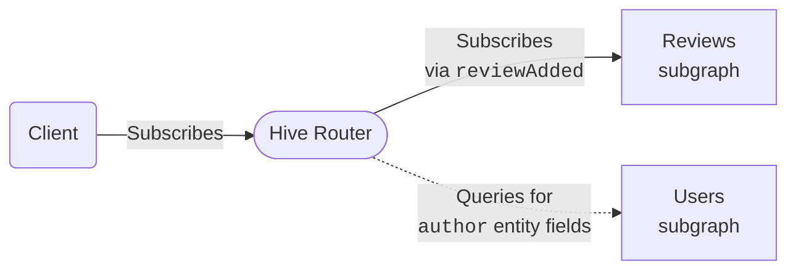

import { Callout } from "@hive/design-system/hive-components/callout";

GraphQL subscriptions enable your clients to receive real-time data. This is essential for applications that need live updates - like notifications, live chat, stock tickers, collaborative editing, or IoT dashboards.

Hive Router provides full support for federated subscriptions out of the box. It works as a drop-in replacement for other federation routers, making it easy to add real-time capabilities to your federated GraphQL architecture.

## How Subscriptions Work

Consider this subscription query against Hive Router:

```graphql
subscription {
  reviewAdded {
    rating
    body
    author {
      name
    }
  }
}
```

This creates the following data flow:



Your client executes a subscription operation against Hive Router over HTTP using either Server-Sent Events (SSE) or multipart responses. The router then executes the same subscription against whichever subgraph defines the requested field - in this case, the Reviews subgraph that provides the `reviewAdded` field. The router communicates with subgraphs using the same protocols: SSE or multipart.

When the Reviews subgraph sends new data, the router receives it and forwards it to the client. If the subscription includes federated entity fields from other subgraphs - like the `author` field that comes from the Users subgraph in this example - the router automatically resolves those fields by querying the corresponding subgraphs over HTTP. This allows you to subscribe to data that spans multiple subgraphs while maintaining a single subscription connection from your client.

## Entity Resolution

One of the most powerful features of federated subscriptions is automatic entity resolution. Your subscription can include fields from multiple subgraphs, and Hive Router handles all the coordination automatically.

```graphql
subscription {
  reviewAdded {
    # From the reviews subgraph
    id
    body
    rating
    # Entity field from the products subgraph
    product {
      name
      price
    }
    # Entity field from the users subgraph
    author {
      name
      email
    }
  }
}
```

In this example:

- The `reviewAdded` subscription is defined in the **reviews** subgraph
- The `product` fields are resolved from the **products** subgraph
- The `author` fields are resolved from the **users** subgraph

Hive Router intelligently determines the optimal way to resolve these entity fields, querying the necessary subgraphs as subscription events arrive. This works exactly like entity resolution for regular queries - no special configuration or considerations needed.

## Supported Protocols

Hive Router supports **all** subscriptions protocols in the ecosystem, both for client-to-router and router-to-subgraph communication:

- [Server-Sent Events (SSE)](/docs/router/subscriptions/sse) - A simple, efficient protocol built on standard HTTP
- [Incremental Delivery over HTTP](/docs/router/subscriptions/incremental-delivery) - From the [Official GraphQL over HTTP spec RFC](https://github.com/graphql/graphql-over-http/blob/main/rfcs/IncrementalDelivery.md)
- [Multipart HTTP](/docs/router/subscriptions/multipart-http) - Based on [Apollo's Multipart HTTP protocol](https://www.apollographql.com/docs/graphos/routing/operations/subscriptions/multipart-protocol)
- [WebSockets](/docs/router/subscriptions/websockets) - Implementing the GraphQL over WebSocket protocol from the [GraphQL over WebSocket](https://github.com/enisdenjo/graphql-ws/blob/master/PROTOCOL.md).
- [HTTP Callback](/docs/router/subscriptions/http-callback) (⚠️ for subgraphs) - The scalable subscriptions protocol for router-to-subgraph communication implementing [Apollo's HTTP Callback Protocol](https://www.apollographql.com/docs/graphos/routing/operations/subscriptions/callback-protocol).

## Protocol Negotiation

For HTTP-based subscriptions (SSE, Incremental Delivery, and Multipart HTTP), the router automatically determines which protocol to use based on the `Accept` header in the client's request:

| `Accept` header                          | Protocol                                                                          |
| ---------------------------------------- | --------------------------------------------------------------------------------- |
| `text/event-stream`                      | [Server-Sent Events (SSE)](/docs/router/subscriptions/sse)                        |
| `multipart/mixed`                        | [Incremental Delivery over HTTP](/docs/router/subscriptions/incremental-delivery) |
| `multipart/mixed;subscriptionSpec="1.0"` | [Multipart HTTP](/docs/router/subscriptions/multipart-http)                       |

The protocols used between the router and subgraphs are independent from those used between clients and the router. For example, a client can use SSE while the router communicates with a subgraph over multipart HTTP. When connecting to subgraphs, the router prefers multipart first, then falls back to SSE.

If a client requests a subscription over an unsupported transport, the router returns `406 Not Acceptable`.

## Configuration

Subscriptions are disabled by default. To enable them, set `enabled: true` in the `subscriptions` section of your router configuration:

```yaml
subscriptions:
  enabled: true
```

You can also enable subscriptions using the `SUBSCRIPTIONS_ENABLED` environment variable:

```bash
SUBSCRIPTIONS_ENABLED=true
```

Once enabled, all HTTP-based subscription protocols (SSE, Incremental Delivery, and Multipart HTTP) are available automatically with no additional configuration. Protocol selection happens at request time via the `Accept` header.

For WebSocket and HTTP Callback protocols, additional configuration is required. See their respective pages for details.
