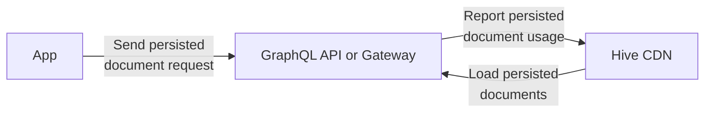
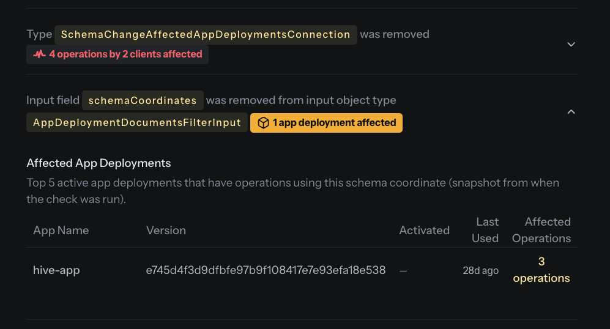

**TL;DR**: After two years of extensive testing and collecting feedback from early adopters we are
happy to share that app deployments are now available for every organization by default. App
deployments are our solution for managing persisted documents at scale.

[Get started with our App Deployments documentation](/docs/schema-registry/app-deployments).

---

## The Problem

When you release a mobile or web app, you’re also shipping the GraphQL operations embedded in that
client. Those operations may live in production for months, while your GraphQL schema continues to
evolve. This creates a common problem:

- Which app versions use which operations?
- Will a schema change break a shipped client?
- Can you safely remove unused fields?

## Introducing App Deployments

App deployments are our interpretation of how to do persisted documents (also known as trusted
documents), observability and breaking change detection the right way when having many different
clients and client versions.

App deployments bring together persisted documents, observability, and conditional breaking change
detection.

App Deployments help you:

- Track which operations each app version ships
- Safely evolve your schema
- Detect breaking changes before clients fail

### Persisted Documents

Adopting persisted documents brings many benefits to your GraphQL Gateway, such as:

- Reduce payload size of your GraphQL requests (reduce client bandwidth usage)
- Secure your GraphQL API by only allowing operations that are known and trusted

Hive Console can now be used as the authority for publishing and serving persisted documents to your
gateway of choice via [our high availability CDN](/docs/schema-registry/high-availability-cdn)
mirrored on the Cloudflare global network and AWS network.

### Conditional Breaking Changes

On our platform app deployments complement the full development and GraphQL lifecycle loop.

Active app deployment versions GraphQL documents are included within our breaking change detection
in addition to the usage based breaking change detection reducing the risk of accidentally removing
GraphQL schema fields and types with low or infrequent traffic.

## Upcoming Features

While app deployments are now generally available for everyone (including the self-hosted Hive
Console version), our vision is not yet fully complete.

We are currently working on several things that will become available soon that will improve the app
deployments experience in the near future:

- Improved upload speeds for persisted documents
- Exposing app deployments as MCP tools via Hive Gateway
- Exposing app deployments as REST endpoints via Hive Gateway

We will share more updates on these as they become available!

---

- [Learn more about App Deployments](/docs/schema-registry/app-deployments)
