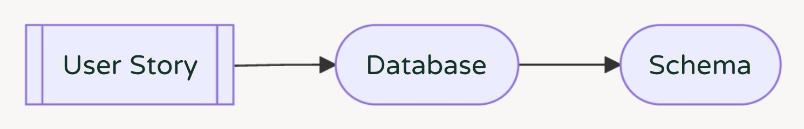
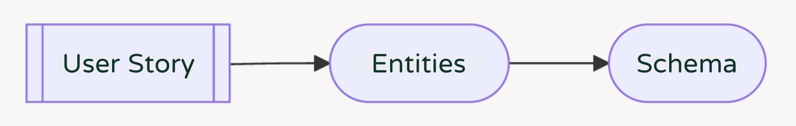

If you've not already read it, we recommend reading [Part 1](./schema-design-best-practices-part-1)
of this article.

In this part, we'll cover several possible design approaches to help you construct your schema.
These are:

1. Inside-Out Design
2. Outside-In Design
3. Domain Driven Design (DDD)

## Inside-Out Design

This is designing from the perspective of the database. You start with user stories that define the
data fields and interactions you need. Then implement the data types and relationships in the
database that satisfy those stories. And lastly, map the database structure to GraphQL types.

### Example

Here’s an example user story for a feature I’ve been working on lately.

> As a user I can author a schema proposal for a target as a draft or ready for review with a short
> title, detailed description

From this we can extract our nouns that could represent attributes or other data types. Action verbs
may also hint at data requirements. Here the phrase “can author a schema proposal” hints that we
need to track who created the schema proposal.

> As a user I can **author** a **schema proposal** for a **target** as a **draft** or **ready for
> review** with a short **title**, detailed **description**.

Inside-out design comes naturally to developers who have been working with databases for a while.
You design the database to meet your requirements, then convert that almost 1:1 to a type. External
references, like Target_ID or User_ID in this example, are exposed as additional fields on your type
– like “Target” and “User”

### Use Case

It makes sense to use Inside-out design:

- If you’re given an existing database and need to get an API up and running
- If your application only calls for simple CRUD calls, because a direct database mapping will meet
  your requirements without extra work.
- If you’re rapidly prototyping something. Because inside-out design lets you focus your time and
  energy elsewhere. Also, any change to the data maps 1:1 to a change in your schema, making changes
  while prototyping a fixed cost.

## Outside-In Design

Start with user stories, but instead of building the database next, build the UI/UX that meets the
requirements. Then, based on proximity and hierarchy, extract types and fields to build the
entities.

### Example

I love to garden here in California and so this example is from a really great tool called Calscape
that is a catalog of native plants.

Ignoring pagination to keep this simple, we can see that this UI has some very clear requirements.
Following the process, we look at all the different components and determine what belongs to the
same “entity”. Again, this is based primarily on proximity and hierarchy. In this case, we can tell
that all the data is referencing a single plant, so it makes sense to add this data as fields to a
"Plant" type.

### Use Case

When to use this would be:

- If the company you work for is design focused and has a strong design team, then it will make your
  life easier if you can leverage this expertise.
- If you only have a single client consuming your schema, then you may want to build your API around
  that one case and revisit it later if that list of clients grows or if those types turn out to be
  confusing.
- Lastly, if there is a feature that has very strict performance requirements and you can’t get it
  to fit in your other types, then you might consider creating a new type based on this instance of
  the UI. It may create some redundancy in your schema, but this can be revisited at a later date.

## Domain Driven Design

Domain driven design is a broad and complex topic. But at its heart it’s based on concepts we use
every day without realizing. One of these concepts is that of a “bounded context”.

### Bounded Context

To me, the concept of bounded context is similar to the concept of abstraction, which is one of
computer science’s fundamental principles. With abstraction, you define specific behavior as
functions, and then can use those functions inside more functions to create a higher-level function
that will do more things, while keeping the code relatively clean. This way at every level, you only
need to understand what the next level is doing instead of having to look at everything at once.

With the bounded context "as a paper company salesman", a "territory" would be a geographical area
for which you're responsible for supplying paper. But "territory" carries different meaning to the
board game Risk. To define a territory's fields, you can then assume the context "as a territory".

### Example

This example diagram shows a number of bounded contexts. Each of the nodes on in this diagram is
itself also a bounded context... and there’s yet another surrounding everything. This seems
complicated and it is, but the human brain is very good at figuring out the right context.

As mentioned, people apply bounded context every day. When chatting with someone, the context is
determined by your relationship with whoever you’re talking to, as well as the conversation up to
that point, as well as time, location, or the current political climate. Inside jokes are a result
of bounded contexts with your friends. Anyone unfamiliar with that context wouldn’t know what you’re
talking about.

When talking about our schemas – **bounded contexts inform your language. And that language becomes
your types**.

With that out of the way, domain driven design is like other approaches.

We start with user stories, but next we define bounded contexts. This requires conversation and
domain knowledge.

- "What other objects exist in your schema?"
- "What is the goal of your API?"
- "Who is the consumer of this schema?"

If you can answer those questions then you can determine the entities and prescribe “ubiquitous
language”, which is the DDD term for "the term people understand".

Be aware that iteration is expected. Contexts are always changing. But thankfully GraphQL is built
with evolution in mind.

### Use Case

- DDD makes sense if your API serves multiple, distinct clients because it lets you map your
  entities by domains rather than by clients.
- If your organization has a strong Product focus, then it may come more naturally to focus on your
  domain objects than client or backend implementations.
- If your team has a history of creating ambiguous types or duplicating data, then you may benefit
  from adding a domain driven design process to your development flow. Again, this could be as
  simple as a couple meetings discussing user stories together.
- If you have a large team, then DDD has the added benefit of letting you define your entities up
  front. So it aligns nicely with another idea called Contract Driven Development. This is when you
  agree on a contract for the structures and functionality up front. Using these practices lets
  schema design happen up front, and then the client and backend work can be done in parallel.

## Conclusion

Ultimately use whatever works best for you. It’s even reasonable to use all three or another
approach not covered here. Whatever you do, don’t be afraid of a few mistakes or of let your schema
evolve over time.

### Recommended Uses

|                   | Inside-Out | Outside-In | Domain Driven |
| ----------------- | ---------- | ---------- | ------------- |
| Engineering Focus | Yes        |            |               |
| Product Focus     |            |            | Yes           |
| Design Focus      |            | Yes        |               |
| Single Client     |            | Yes        |               |
| Multiple Clients  |            |            | Yes           |
| Prototyping       | Yes        |            |               |
